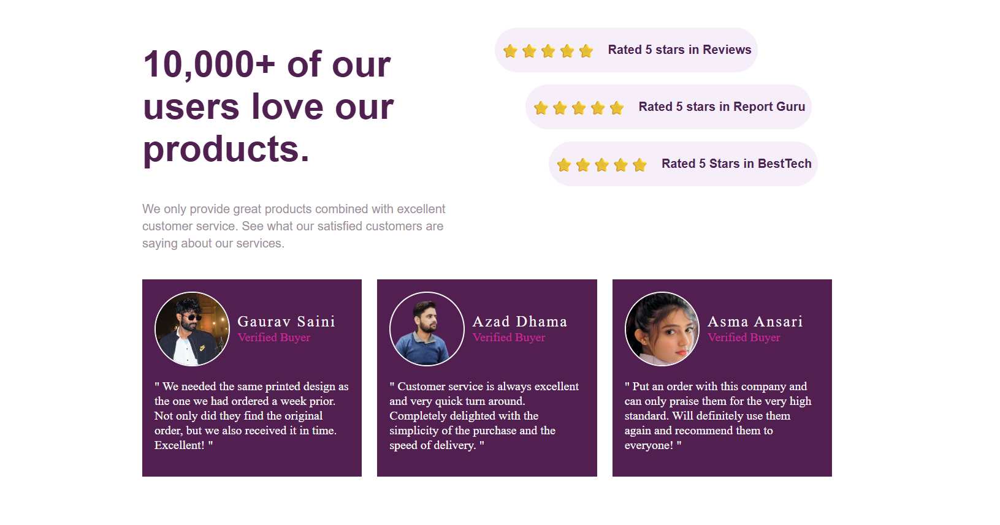

# Social Proof Section

A modern **Social Proof UI Component** built using **HTML & CSS (Grid + Flexbox)**.  
This project focuses on clean layout structure, responsive behavior, and staggered review card alignment.

---

## 🔥 Features
- Fully Responsive Design (Desktop → Tablet → Mobile)
- CSS Grid Layout for structure
- Flexbox for inner alignment
- Adaptive Typography using `clamp()`
- Staggered Review Cards
- Clean UI & Consistent Spacing

---

## 🛠 Tech Stack
- HTML5
- CSS3 (Grid, Flexbox, Media Queries)

---

## 📸 Preview

## 📸 Mobile Preview

---

## 🚀 Live Demo
[View Live](https://golu-dhama.github.io/social-proof-section/)

---

## 📂 Project Purpose
This project was created to practice:
- Responsive Grid Systems  
- Auto-fit / Minmax Concepts  
- Alignment & Spacing Logic  
- Real-world UI Component Building  

---

## ✨ Author
Made with focus on learning and clean design.
